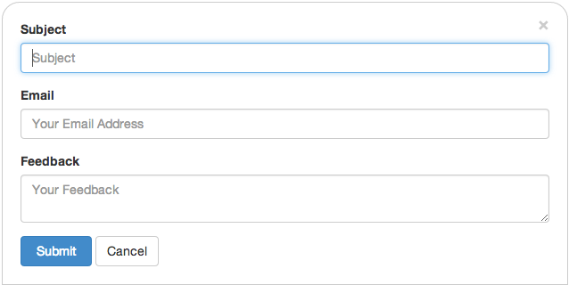

Contact form + mailer for Meteor.
===============


This module will install a link at the bottom of your page. When the user clicks the link, the contact form will slide up from the bottom.

Simply 3 fields for subject, email and content.



All form elements are styled via Bootstrap.

##Status
Initial release. Works perfect in Chrome, not yet tested on other browsers. Feel free to test and send feedback or pull requests.

##Installation
```
mrt add contact
```
##Usage
This module uses configuration form your [Meteor.settings](http://docs.meteor.com/#meteor_settings):

```
{
...
  "contact": {
    "email": {
      "to": "<YOUR RECIPIENT ADDDRESS>",
      "type": "SMTP",
      "options": {
        "service": "Gmail",
        "auth": {
          "user": "<MAIL ACCOUNT TO SEND FROM>",
          "pass": "<PASSWORD>"
        }
      }
    }
  },
...
}
```
For sending mails I use [Nodemailer](http://www.nodemailer.com/). Please see the [Transports section](http://www.nodemailer.com/docs/transports) for all available options like [SMTP](http://www.nodemailer.com/docs/smtp), [Sendmail](http://www.nodemailer.com/docs/sendmail), [Amazon SES](http://www.nodemailer.com/docs/ses), [Direct](http://www.nodemailer.com/docs/direct) and [Pickup](http://www.nodemailer.com/docs/pickup).

The `options` object from the settings will be passed to the `createTransport` method of Nodemailer. So you're free to configure what you need.


To place the link, simply add this to your template:
```
{{> contact title='Contact'}}
```

The `title` parameter can contain whatever you like. You can place a [Glyphicon](http://getbootstrap.com/components/#glyphicons) from Bootstrap there as well:
```
{{> contact title='<i class="glyphicon glyphicon-envelope"></i>'}}
```

The link is positioned absolute at the bottom center of your page. Make sure surrounding HTML/CSS has no conflicting definitions or override the [CSS/LESS definitions](https://github.com/udondan/meteor-contact/blob/master/lib/contact.less) to fit your needs.

###License
MIT
